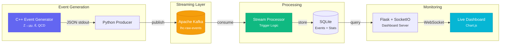

# LHC Data Streaming & Monitoring Pipeline


A real-time data streaming pipeline inspired by CERN's LHC data acquisition infrastructure. I built this to teach myself how detector data actually flows from readout to analysis—from event generation all the way through streaming, triggering, and live monitoring.

---

## 🗺️ Project Roadmap

- [x] **Phase 1**: Core C++ Event Generator & Kafka Producer.
- [x] **Phase 2**: Python-based Trigger Engine & SQLite Storage.
- [x] **Phase 3**: Real-time Dashboard with Chart.js visualization.
- [x] **Phase 4**: CI/CD Integration and Physics Validation (Z-mass peak).
- [ ] **Phase 5**: Scalability testing with Kubernetes (K8s) deployment.
- [ ] **Phase 6**: Integrating secondary AI-based anomaly detection (see [QuarkStream](https://github.com/Divij-Bhoj/QuarkStream)).

---

The pipeline simulates proton-proton collision events in C++, streams them through Apache Kafka, applies physics trigger logic (similar to ATLAS/CMS HLT paths), stores results in SQLite, and visualizes everything on a live dashboard.


**Technologies:** C++17 · Apache Kafka · Python · SQLite · JavaScript · Chart.js · Flask · Docker

> **See also:** [LHCEventAnalysis](https://github.com/Divij-Bhoj/LHCEventAnalysis) — my batch analysis pipeline (C++/ROOT/FastJet) that complements this streaming project.

---

## Architecture



## Data Flow

```
┌─────────────────┐     ┌──────────┐     ┌──────────────────┐     ┌───────────┐     ┌───────────┐
│  C++ Generator   │────▶│  Kafka   │────▶│ Stream Processor │────▶│  SQLite   │────▶│ Dashboard │
│  ~10⁵ evt/s     │     │ Producer │     │ Trigger Engine   │     │  Storage  │     │  Live UI  │
└─────────────────┘     └──────────┘     └──────────────────┘     └───────────┘     └───────────┘
```

## Features

### C++ Event Generator
- Simulates three physics processes: **Z→μ⁺μ⁻**, **tt̄→ℓ+jets**, **QCD multi-jet**
- Uses Breit-Wigner mass distributions and physically motivated kinematics
- Configurable pileup, event rates, and random seeds
- Modern C++17 with CMake build system (FetchContent for [nlohmann/json](https://github.com/nlohmann/json))
- Outputs JSON at **~10⁵ events/second**

### Kafka Streaming Pipeline
- **Producer**: Reads JSON events from stdin/file, publishes to Kafka with gzip compression
- **Consumer**: Subscribes to raw events, applies trigger logic, stores to SQLite
- Retry logic and configurable batch sizes for production-grade reliability
- Docker Compose setup with KRaft mode (no Zookeeper required)

### Physics Trigger System
- **HLT_mu25**: Single isolated muon with pT > 25 GeV
- **HLT_2mu_Zmass**: Opposite-sign dimuon pair in Z mass window (75–105 GeV)
- **HLT_4j50**: ≥4 jets with pT > 50 GeV
- **HLT_met50**: Missing transverse energy > 50 GeV
- Computes invariant masses and ΔR separation

### Real-Time Dashboard
- Live event rate monitoring with 30-second rolling window
- Dimuon invariant mass spectrum (Z boson peak visualization)
- Missing transverse energy distribution
- Per-trigger efficiency bars with live percentages
- Dark theme inspired by CERN control rooms
- WebSocket + REST API with automatic fallback

---

## Quick Start

### Prerequisites
- **C++ compiler** with C++17 support (g++ ≥ 7 or clang++ ≥ 5)
- **CMake** ≥ 3.14
- **Python** ≥ 3.8
- **Docker** & Docker Compose (for Kafka)

### 1. Clone & Setup

```bash
git clone https://github.com/Divij-Bhoj/lhc-data-pipeline.git
cd lhc-data-pipeline
chmod +x scripts/setup.sh
./scripts/setup.sh
```

### 2. Start Kafka

```bash
docker compose up -d
```

### 3. Generate & Stream Events

```bash
# Terminal 1: Generate events and publish to Kafka
./event_generator/build/event_generator -n 50000 --rate 500 | python -m pipeline.producer
```

### 4. Process Events

```bash
# Terminal 2: Consume from Kafka, apply triggers, store in SQLite
python -m pipeline.consumer
```

### 5. Launch Dashboard

```bash
# Terminal 3: Start the monitoring dashboard
python -m dashboard.server
# Open http://localhost:5000
```

---

## Project Structure

```
lhc-data-pipeline/
├── event_generator/            # C++17 event simulation
│   ├── CMakeLists.txt          # CMake build with FetchContent
│   ├── include/
│   │   └── event_generator.h   # Core classes and physics constants
│   └── src/
│       ├── event_generator.cpp # Physics process implementations
│       └── main.cpp            # CLI entry point
├── pipeline/                   # Python streaming pipeline
│   ├── config.py               # Centralized configuration
│   ├── producer.py             # Kafka producer (stdin → Kafka)
│   ├── consumer.py             # Kafka consumer + SQLite writer
│   └── trigger.py              # Physics trigger algorithms
├── dashboard/                  # Real-time monitoring UI
│   ├── server.py               # Flask + SocketIO backend
│   ├── templates/
│   │   └── index.html          # Dashboard layout
│   └── static/
│       ├── css/style.css       # Dark theme styling
│       └── js/app.js           # Chart.js visualizations
├── database/
│   └── schema.sql              # SQLite schema
├── scripts/
│   └── setup.sh                # Automated setup
├── docker-compose.yml          # Kafka (KRaft mode)
├── requirements.txt            # Python dependencies
└── data/                       # Runtime data (git-ignored)
```

## Event Generator Usage

```bash
# Generate 50,000 events at max speed
./event_generator/build/event_generator -n 50000

# Stream infinite events at 100 Hz
./event_generator/build/event_generator -n 0 --rate 100

# Custom run number and seed
./event_generator/build/event_generator -n 10000 -r 42 -s 12345

# Adjust pileup conditions
./event_generator/build/event_generator -n 10000 --pileup 40
```

### Sample Event Output
```json
{
  "event_id": 1,
  "run_number": 1,
  "timestamp_ms": 1708800000000,
  "event_type": "z_mumu",
  "num_particles": 28,
  "num_jets": 2,
  "num_muons": 2,
  "met": 18.432,
  "sum_et": 342.17,
  "particles": [
    {"pdg_id": -13, "pt": 45.2, "eta": -0.83, "phi": 1.24, "energy": 52.1, "mass": 0.106, "is_isolated": true},
    {"pdg_id": 13, "pt": 42.8, "eta": 1.12, "phi": -1.89, "energy": 68.3, "mass": 0.106, "is_isolated": true}
  ]
}
```

## Configuration

All pipeline parameters are configurable via `pipeline/config.py` or environment variables:

| Parameter | Default | Env Variable |
|-----------|---------|--------------|
| Kafka Bootstrap | `localhost:9092` | `KAFKA_BOOTSTRAP` |
| Database Path | `data/lhc_events.db` | `LHC_DB_PATH` |
| Dashboard Port | `5000` | `DASHBOARD_PORT` |
| Muon pT Threshold | 25 GeV | — |
| Z Mass Window | 75–105 GeV | — |
| Jet pT Threshold | 50 GeV | — |
| MET Threshold | 50 GeV | — |

## Technologies

| Component | Technology | Purpose |
|-----------|-----------|---------|
| Event Generator | **C++17**, CMake, nlohmann/json | High-performance physics simulation |
| Message Broker | **Apache Kafka** (KRaft) | Distributed event streaming |
| Stream Processing | **Python**, kafka-python | Trigger logic and filtering |
| Storage | **SQLite** | Event and statistics persistence |
| Dashboard Backend | **Flask**, Flask-SocketIO | REST API + WebSocket server |
| Dashboard Frontend | **JavaScript**, Chart.js | Real-time data visualization |
| Infrastructure | **Docker Compose** | Container orchestration |

## Project Metadata

- **Author:** Divij Bhoj
- **Purpose:** CERN Technical Studentship Application Portfolio
- **Technologies:** C++17, Apache Kafka, Python, Flask, SQLite, JavaScript, Chart.js, Docker
- **Disclaimer:** This project uses simulated data for educational purposes. Not affiliated with official LHC experiments.

## Contributing

This is a personal portfolio project, but suggestions are welcome:

1. Fork the repository
2. Create a feature branch (`git checkout -b feature/new-trigger`)
3. Commit changes (`git commit -am 'Add dielectron trigger path'`)
4. Push to branch (`git push origin feature/new-trigger`)
5. Open a Pull Request

## License

MIT License : see [LICENSE](LICENSE) for details.

If used in academic work, please cite:
```
Divij Bhoj (2026). LHC Data Streaming & Monitoring Pipeline.
GitHub: https://github.com/Divij-Bhoj/lhc-data-pipeline
```

## Contact

**Divij Bhoj** · 📧 [divijbhoj@gmail.com](mailto:divijbhoj@gmail.com) · 🐙 [GitHub](https://github.com/Divij-Bhoj)
